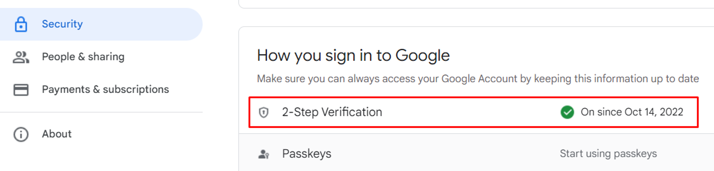
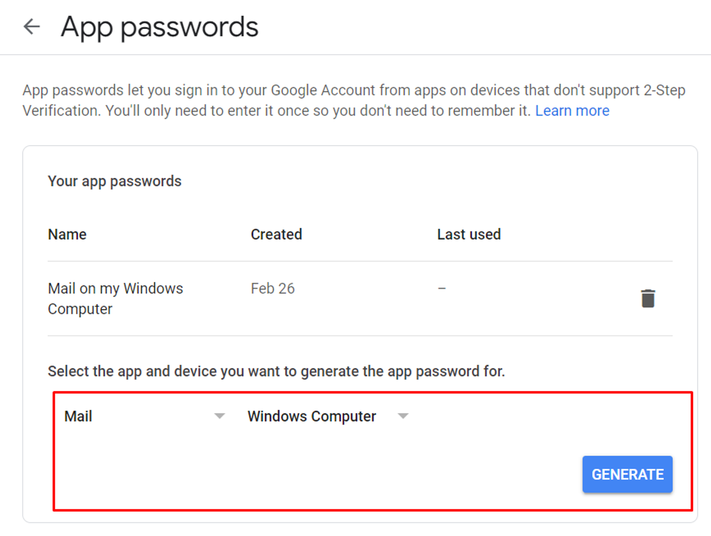

# Fix-Me

This file provides information on known issues and steps to fix them.

## Unfixed Bugs

### 1. Blog Posts Persist After User Deletion

**Issue:**
When a user deletes their account, the associated blog posts remain visible.

**Fix:**
Implement a cascade delete functionality to remove all associated blog posts when a user account is deleted. Ensure that the database model and deletion logic are correctly configured.

### 2. Comments Still Displayed Despite Blocking

**Issue:**
Comment blocking does not prevent comments from being displayed.

**Fix:**
Review the comment blocking logic and ensure that it correctly filters out blocked comments from being shown. Check if there are any issues with the implementation or if additional checks are needed.

## Update Schedule

We are actively working on fixing the above issues. Expect updates soon.

## Setting Up Mail Service

Follow the steps below to set up the mail service:

1. Access [Google Account Security](https://myaccount.google.com/security).

2. Turn on 2-Step Verification.

   

3. Scroll down to the bottom of the page and click on "App passwords."

   

4. Copy the generated password and replace `SMTP_PASS` in your configuration.

   Example configuration:

   ```plaintext
   SMTP_HOST=smtp.gmail.com
   SMTP_PORT=587
   SMTP_USER=your_email@gmail.com
   SMTP_PASS=copied_password_above

### Step to run server

   ```plaintext
   cp .env.example ./.env
   

